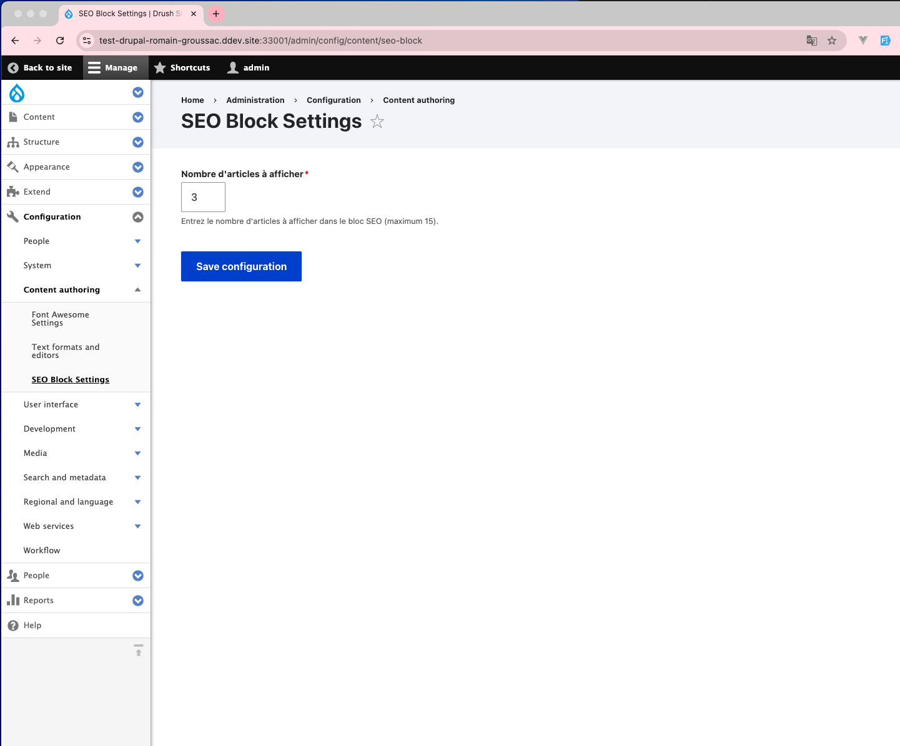

# Partie 2 – Développement d’un module custom
1. Bloc affichant les derniers articles avec leur score SEO
   
2. Parametrage du bloc dans l'interface d'administration
   

------

### [Partie 1 – Modélisation & Migration](./1-modelage-et-migration.md)
### [Partie 3 – Automatisation & Sécurité](./3-automatisation-et-securite.md)
### [Partie 4 – Tableau de bord & Reporting](./4-dashboard-et-reporting.md)
