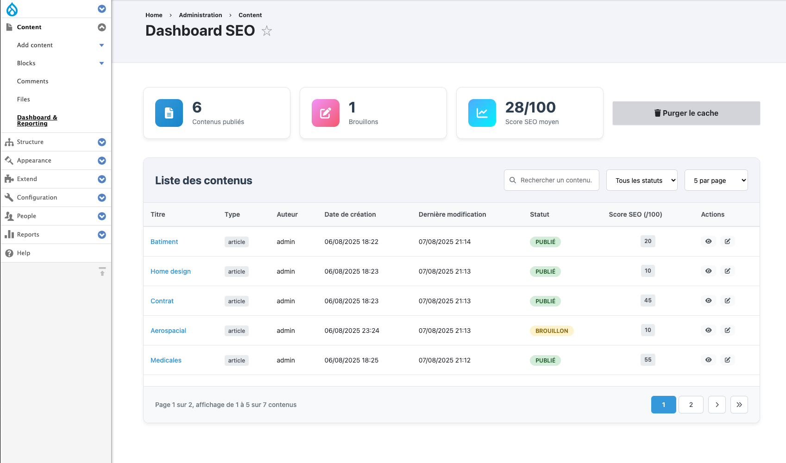

# Partie 4 – Tableau de bord & Reporting
Tableau de bord avec la liste des contenus, indicateurs statistiques, et bouton pour lancer manuellement une purge cache

------

### [Partie 1 – Modélisation & Migration](./1-modelage-et-migration.md)
### [Partie 2 – Développement d’un module custom](./2-developpement-du-module-custom.md)
### [Partie 3 – Automatisation & Sécurité](./3-automatisation-et-securite.md)
